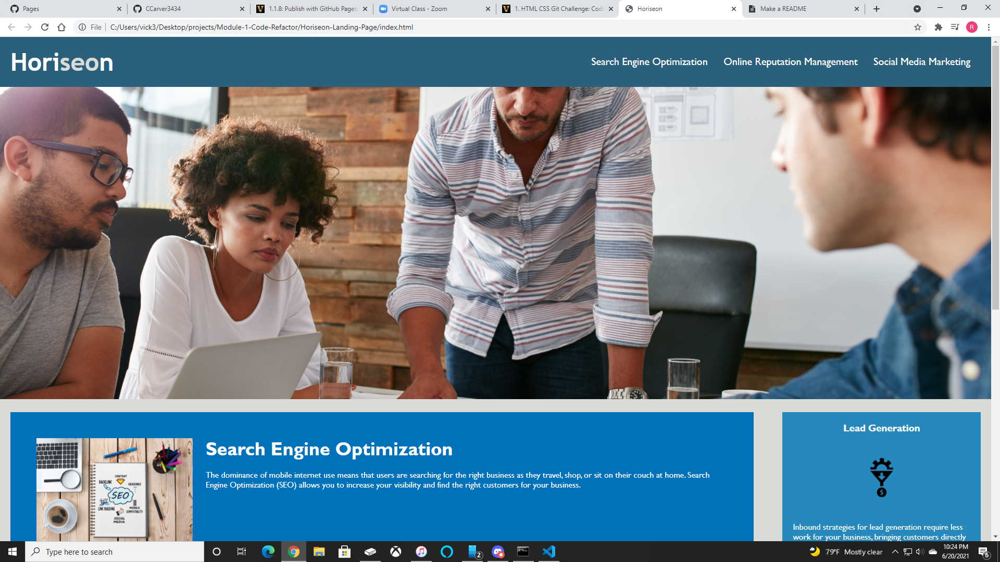

# Horiseon Landing Page

## Description

[Horiseon's](https://ccarver3434.github.io/Horiseon-Landing-Page/) Landing Page demonstrates a completion of HTML CSS Git Challenge: Code Refactor. The starting code was given to us, and the challenge was to refactor the code. The goal was to hit certain acceptance criteria, improve accessibility, and clean up code.

## Usage

Here is a screenshot of the website being deployed, along with a link below:

```md

```

[Horiseon](https://ccarver3434.github.io/Horiseon-Landing-Page/)

## Acceptance Criteria

GIVEN a webpage meets accessibility standards

WHEN I view the source code

THEN I find semantic HTML elements

WHEN I view the structure of the HTML elements

THEN I find that the elements follow a logical structure independent of styling and positioning

WHEN I view the image elements

THEN I find accessible alt attributes

WHEN I view the heading attributes

THEN they fall in sequential order

WHEN I view the title element

THEN I find a concise, descriptive title